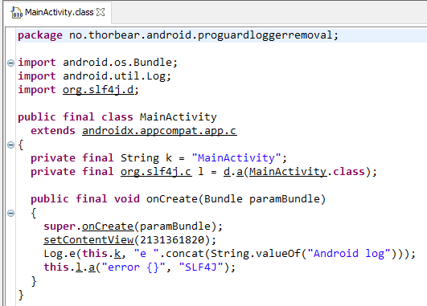
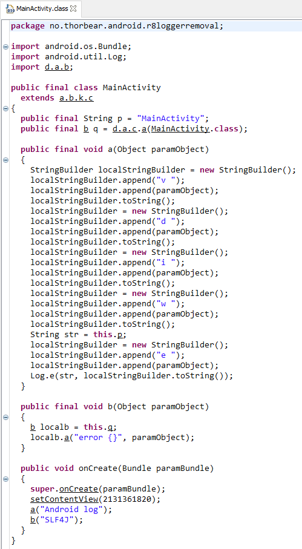

# R8 / ProGuard logger removal comparison

## This problem is fixed in Android Gradle Plugin 3.6.0-beta01 and later






## Using the default version of R8 that comes with Android Gradle Plugin 3.6.0-alpha10 and earlier 

It appears that R8 does not remove logging code the same way that ProGuard does when the `assumenosideeffects` rule is used.


### proguard-rules.pro

```
-assumenosideeffects class android.util.Log {
    public static *** v(...);
    public static *** d(...);
    public static *** i(...);
    public static *** w(...);
}
-assumenosideeffects class * implements org.slf4j.Logger {
    public *** trace(...);
    public *** debug(...);
    public *** info(...);
    public *** warn(...);
}
```


### Decompiled class obfuscated by ProGuard


### Decompiled class obfuscated by R8


